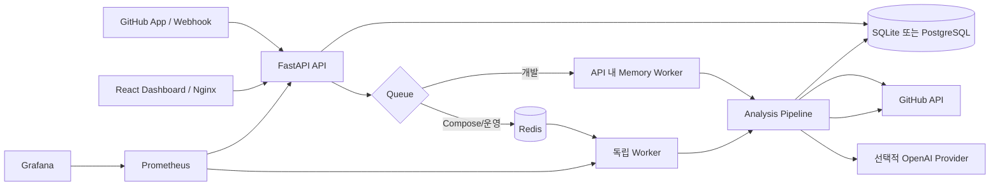
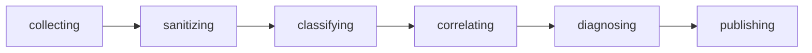

# PipeLens 아키텍처

## 1. 목표와 경계

PipeLens는 GitHub Actions 실패 로그를 단순 요약하지 않는다. 실패 job·step, 정제된 핵심
로그, 변경 파일, workflow 설정과 실행 환경을 교차 검증한 뒤 근거가 있는 진단만 게시한다.

MVP의 입력은 GitHub Actions `workflow_run.completed` 실패 이벤트 하나이며, 출력은 다음과
같다.

- 저장된 구조화 분석 결과
- PR이 연결된 실행의 멱등 PR 코멘트
- PR이 없는 신뢰 가능한 실행의 Commit Check
- 사용자 대시보드와 피드백
- Prometheus 운영 지표

Slack·Jira 연동, 자동 merge·재배포, 다른 CI 플랫폼, Kubernetes 런타임 분석은 현재 경계
밖이다.

## 2. 런타임 구성

### 실행 모드

| 모드 | 데이터베이스 | Queue/Worker | 용도 |
| --- | --- | --- | --- |
| 기본 로컬 | SQLite | 메모리 queue와 API 내부 worker | 빠른 개발·테스트 |
| Docker Compose | PostgreSQL | Redis와 독립 worker | 운영 구조에 가까운 통합 실행 |

API와 worker는 같은 Python 이미지를 사용한다. API와 대시보드 이미지는 각각 `pipelens`,
`nginx` 비권한 사용자로 실행한다. 대시보드 컨테이너 내부 포트는 비특권 포트 `8080`이고
Compose가 호스트 `3000`에 연결한다.

## 3. Webhook 처리

`POST /webhooks/github`의 처리 순서는 다음과 같다.

1. 요청 원문에 대해 `X-Hub-Signature-256` HMAC-SHA256을 상수 시간 비교로 검증한다.
2. `workflow_run` 이벤트가 아니면 무시한다.
3. `action=completed`, `conclusion=failure`가 아니면 무시한다.
4. GitHub delivery ID와 workflow run ID를 저장한다.
5. 이미 존재하는 run은 새 분석 레코드를 만들지 않는다.
6. DB 기록 뒤 분석 요청을 queue에 넣고 `202 Accepted`를 반환한다.
7. DB 저장 후 queue 전달이 실패해도 webhook 재전달 또는 API 시작 시 reconciliation이
   `queued` 레코드를 다시 적재한다.

Webhook 요청은 긴 분석을 직접 수행하지 않는다. 이를 통해 GitHub 재전달 시간과 분석
실행 시간을 분리한다.

## 4. 분석 파이프라인

분석은 여섯 단계로 기록된다.

### 4.1 collecting

- GitHub App installation token을 생성한다.
- 실패 job, 실패 step, runner labels, workflow·branch 정보를 수집한다.
- 실패 job 로그를 내려받는다.
- PR 또는 직전 성공 실행을 기준으로 변경 파일과 patch를 수집한다.
- 실행 시점의 workflow 파일을 수집한다.
- head 저장소와 base 저장소가 다르면 `untrusted_fork`로 분류한다.

로그, job 정보와 저장소 context는 서로 독립적인 GitHub 요청이므로 가능한 부분을 동시에
수집한다. 저장소 context 수집이 실패해도 로그 기반 분석은 계속한다.

### 4.2 sanitizing

- ANSI escape sequence와 불필요한 timestamp를 제거한다.
- 큰 로그는 문자 수 제한에 따라 chunk로 나눈다.
- 각 chunk를 먼저 마스킹한 뒤 오류 신호 주변 구간만 선택한다.
- GitHub token, AWS key, JWT, Authorization header, API key, 비밀번호·secret 환경변수와
  이메일을 마스킹한다.
- 변경 patch, workflow 내용, workflow·branch·runner 문자열에도 같은 마스킹을 적용한다.

원본 로그 전체를 분석 결과 DB에 저장하지 않는다. 이후 분류와 LLM 입력은 정제·마스킹된
문자열만 사용한다.

### 4.3 classifying

규칙 엔진은 최초 오류 신호를 우선해 다음 10개 범주와 `unknown`을 판정한다.

`test_failure`, `build_failure`, `dependency_installation_failure`,
`lint_or_formatter_failure`, `docker_build_failure`,
`deployment_authentication_failure`, `missing_environment_variable`, `timeout`,
`resource_exhaustion`, `github_actions_workflow_error`.

결과에는 confidence, 최초 오류, 관련 job/step과 일치한 규칙을 포함한다.

### 4.4 correlating

변경 파일별 점수는 로그에 등장한 경로·파일명·코드 토큰과 오류 범주별 파일 친화도를
조합한다. 점수가 높은 파일만 patch excerpt와 함께 다음 단계로 전달한다. 연결할 파일이
없으면 추측해서 채우지 않고 결과 note에 명시한다.

### 4.5 diagnosing

규칙 결과로 항상 fallback 진단을 먼저 만든다. LLM provider가 활성화되고 입력이 신뢰
가능한 경우에만 Structured Outputs 요청을 보낸다.

LLM 결과는 다음 조건을 다시 검증한다.

- evidence가 실제 정제 로그·workflow·관련 patch에 존재하는가
- 제안한 파일 경로가 수집된 저장소 파일에 존재하는가
- 규칙 분류와 충돌하는가
- 원인을 뒷받침할 evidence가 하나 이상 있는가

검증 실패 또는 provider 장애 시 규칙 진단을 유지한다. 사용 모델과 prompt version,
token·지연·추정 비용은 별도로 기록한다.

`untrusted_fork`에서는 로그, diff와 workflow를 LLM으로 보내지 않고 규칙 진단만 사용한다.

### 4.6 publishing

`PIPELENS_PUBLISH_CHECKS=true`일 때만 게시한다.

- PR 번호가 있으면 숨은 run marker로 기존 코멘트를 찾아 생성 또는 갱신한다.
- PR이 없고 신뢰 가능한 실행이면 head SHA에 Commit Check를 생성 또는 갱신한다.
- 외부 fork이며 PR을 확인하지 못하면 fork SHA에 Check를 만들지 않는다.
- 게시물에는 상세 대시보드 URL, 비교 SHA 범위와 신뢰 경계를 포함한다.

## 5. Queue 신뢰성 모델

### 메모리 queue

단일 API 프로세스에서 사용한다. API lifecycle이 worker를 시작·종료하며 테스트와 간단한
로컬 실행에 적합하다.

### Redis queue

- run ID 등록과 pending 적재를 원자적으로 수행해 중복 enqueue를 막는다.
- worker별 processing 목록과 TTL lease를 둔다.
- heartbeat가 살아 있는 worker의 작업은 회수하지 않는다.
- lease가 만료된 작업만 원자적으로 pending에 복구한다.
- 실패한 작업은 제한된 횟수만 재시도한다.
- API 시작 시 DB의 `queued` 요청과 queue를 reconciliation한다.

### Fencing

각 분석 시작은 새로운 attempt token을 발급한다. lease 만료 뒤 이전 worker가 재개해도 현재
token과 일치하지 않는 상태·단계 변경과 게시는 `AnalysisAttemptSuperseded`로 거부된다. 이
토큰은 중복 실행 자체보다 더 중요한 **늦게 도착한 오래된 실행의 부작용 방지**를 담당한다.

## 6. 저장 모델

SQLAlchemy 저장 계층은 SQLite와 PostgreSQL을 같은 인터페이스로 제공한다. Alembic
migration은 다음 순서로 확장됐다.

| Migration | 추가 내용 |
| --- | --- |
| `0001` | 분석 기본 레코드 |
| `0002` | 정확도·해결 피드백 |
| `0003` | GitHub 사용자, OAuth session, installation 접근 |
| `0004` | fork trust level |
| `0005` | 직전 성공 baseline SHA |
| `0006` | 분석 단계 이력 |
| `0007` | attempt fencing token |
| `0008` | 마스킹된 실행 context |
| `0009` | 시작·완료·queue wait·전체 latency |

분석 상태는 `queued`, `running`, `completed`, `failed`다. 단계 이벤트는 각 단계의
`started`, `completed`, `failed`와 제한된 오류 메시지를 보존한다.

## 7. 인증과 접근 제어

- 로그인은 GitHub OAuth authorization code flow를 사용한다.
- OAuth state cookie로 callback 위조를 방지한다.
- 사용자 access token은 Fernet으로 암호화해 저장한다.
- session cookie는 HttpOnly, SameSite=Lax이며 운영에서는 Secure를 강제한다.
- 분석 목록·상세·피드백은 로그인 사용자가 접근 가능한 GitHub App installation ID로
  제한한다.
- 개발·API 테스트에서만 `PIPELENS_AUTH_REQUIRED=false`를 명시할 수 있다. 운영 설정은 이
  값을 거부한다.

## 8. API와 대시보드

주요 endpoint는 root `README.md`의 API 목록을 기준으로 한다. 목록 API는 category, status,
repository 필터와 `(created_at, run_id)` 기반 opaque cursor pagination을 지원한다. offset
대신 cursor를 사용해 새 분석이 들어오는 동안 페이지 중복·누락 가능성을 줄였다.

React 대시보드는 다음을 제공한다.

- GitHub 로그인·App 설치 상태
- 분석 상태, 오류 범주와 신뢰 경계 필터
- 과거 페이지 추가 로딩
- 단계 진행·소요 시간과 실행 context
- 근거, 관련 파일, 비교 범위, GitHub run 딥링크
- 정확도와 제안 해결 여부 피드백
- keyboard·label·live region 중심의 접근성 semantics

## 9. 관측성과 상태 확인

- `/healthz`: 프로세스 생존만 확인한다.
- `/readyz`: DB와 queue를 각각 확인하고 하나라도 실패하면 `503`을 반환한다.
- `/metrics`: webhook, 분석 결과·시간, queue wait·복구·깊이, SLO, 오류 범주, trust level,
  redaction, chunk, HTTP retry, LLM token·비용, feedback 지표를 노출한다.

Prometheus 규칙은 API/worker 중단, 분석 시작·완료 SLO 위반과 queue backlog를 감지한다.
Grafana dashboard는 같은 지표를 시각화한다. Compose에는 Alertmanager가 포함되지 않는다.

## 10. 배포 경계

Compose는 개발과 통합 검증을 위한 단일 호스트 구성이다. 운영 배포에는 다음이 별도로
필요하다.

- HTTPS 종료와 HSTS
- secret manager 또는 동등한 비밀 주입 수단
- PostgreSQL·Grafana 데이터 백업과 복구 절차
- Alertmanager와 실제 알림 채널
- `immutable: true`인 차기 GitHub Release 발행 확인과 GHCR retention 정책
- 외부에서 접근 가능한 GitHub OAuth callback, App setup URL과 webhook URL
